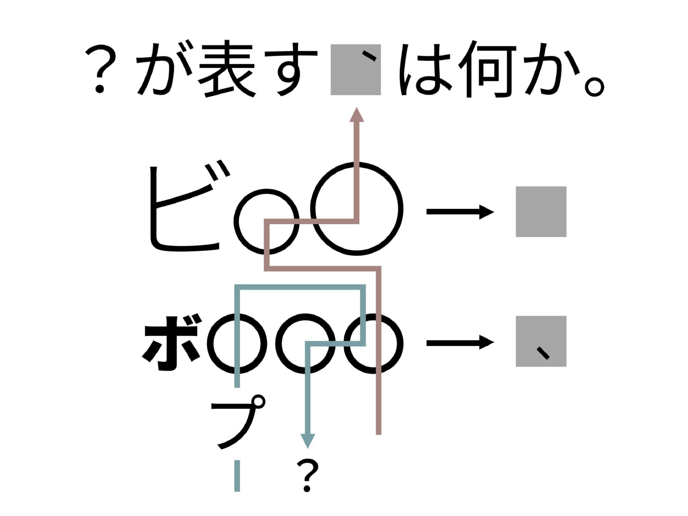
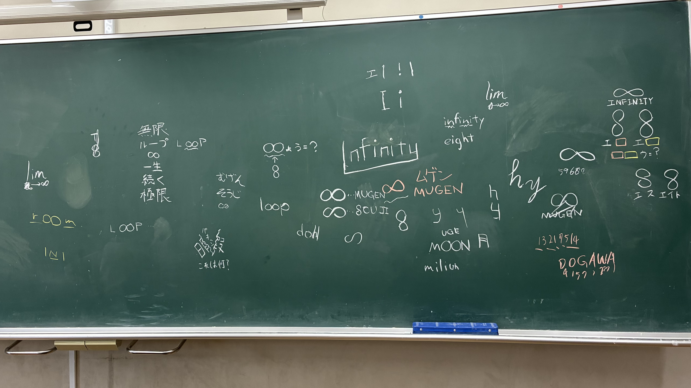
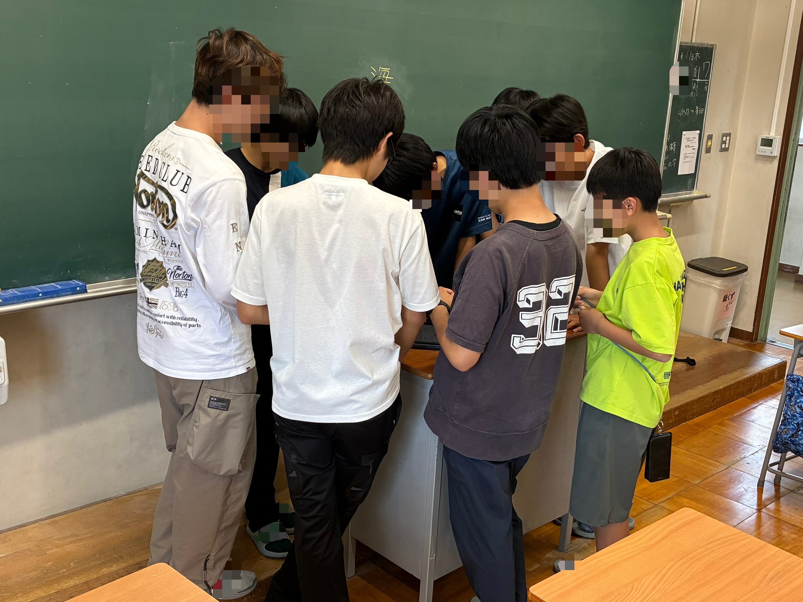
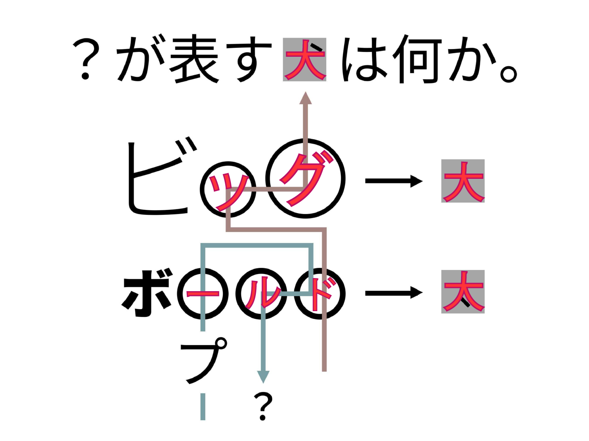
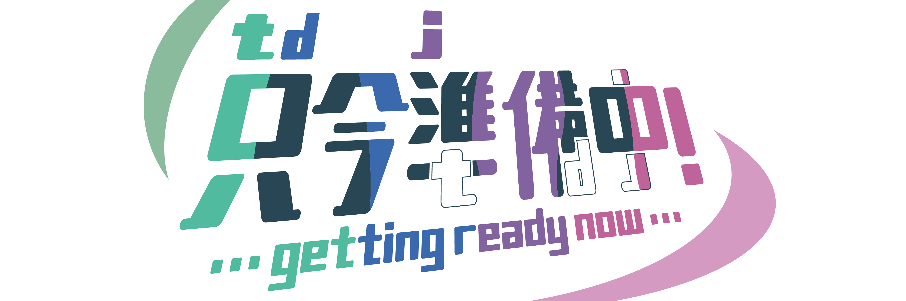

# 謎解き同好会について

みなさん、まず謎解き同好会と聞いても、「謎解きって何？」と思う人もいると思います。私も中学1年生のころはそうでした。謎解きが何かわからないという人は、松丸亮吾くんが出しているような問題を想像してもらうとわかりやすいと思います。松丸亮吾くんの出す問題とは、知識だけで解ける問題ではなく、ほんの少しの知識とものすごいひらめきで解ける問題なのです。

そう、謎解きとは、**ひらめき力**を問う問題なのです。

こんな感じです↓(後ほど解説します。)

謎解き(例)ぜひ解いてみてください！

# 謎解き同好会ができた経緯

実は、私が東大寺学園中学校に入学したとき、謎解き同好会はありませんでした。ならなぜ今あるのか？それは「**自分たちで作ったから**」です。東大寺学園では生徒が自分で部活を立ち上げることが可能である、というシステムを利用したのです。でも私が「よし！謎解き同好会を作ろう！」と思って作ったわけではありません。

中学1年生のとき、私には入学式から仲がよかったOさんがいて、Oさんによく謎解きの問題を出してもらっていました。そのときに私は、「謎解きってこんなに面白いんだ！」と知り、Oさんと謎解き同好会を作ろう！ということになりました。そして人を集め、2024年3月、「**謎解き研究会**」として発足しました。「**謎解き同好会**」という名前に変わったのは2025年になってからのことです。

# 普段どんな活動をしているのか？

普段は普通の教室(現在は4年D組)で活動していて、謎を作って解きあったり、謎解きのイベントなどを企画したりしています。

### じゃあ実際どんな感じで活動してるのでしょうか？

実際に活動しているときの黒板を見てみましょう！

謎解き制作中の黒板

これは第62回菁々祭のテーマ「**Inf****i****n****i****ty**」に関する謎解きを考えている途中の黒板の様子です！とにかく思いついたことを色々書いてみて、他の部員と話し合い、どれが最も楽しそうな謎解きになるか？どれが最も難しそうな謎解きになるか？ということを考えて謎解きを作っています。

謎解き同好会では、謎解きを作るだけでなく、ネットに上がっている謎解きを解く、ということも活動の一環として行なっています。特に「**NazoMondo**」では毎回どこを開くか、どこからどこから解いていくか、と議論し盛り上がっています。

みんなで謎解きしている最中の様子

# 謎解きの解説

最初に例として出した謎解きの解説をしたいと思います。先ほどの問題は会長のOさんが作った問題で、私も解くのに苦労しました！少し難しい問題ですが、Oさんがわかりやすい解説を作ってくれたのでぜひ読んでみてください！

## 解説

この問題は矢印の左にある文字がどうなっているのかに着目することが解くためのカギでした。
一つ目の｢ビ〇〇｣は大きく、二つ目の｢ボ〇〇〇｣は太い。
このことから｢大きい｣｢太い｣の英語である｢ビッグ｣｢ボールド｣が入るのではないかと推測できます。
そして赤い矢印が通った文字を読むと｢ドッグ｣となります。
そして、もう一つ大事なポイントに気付けたでしょうか。
ビッグ→｢大｣、ボールド→｢太｣、ドッグ→｢犬｣。
灰色の四角に｢大｣の字を入れると全て法則が成り立ちました。最後に青い矢印を読むと……
？が表す犬は｢**プードル**｣でした。

解説画像

# 私たちが挑戦していること

## 他の部活とのコラボ

私たちは普段、1つの団体として活動していますが、文化祭では他の部活とコラボすることもあります。去年は暗号同好会と文藝同好会と共に、**校内周遊型の謎解きゲーム**を作り、来場者さんに高評価をいただきました！

今年もコラボをして新しいゲームを作る予定ですので、お楽しみに！

## リアル脱出ゲーム甲子園へ挑戦

「**SCRAP**」という会社が開催する**リアル脱出ゲーム甲子園**。私はこの甲子園の存在を知った中学生のときから、「出てみたいな」と思っていたのですが、参加資格が高校生からなのでただ待つしかありませんでした。今年度、ようやく高校1年生になり参加資格を得たので、謎解き同好会の高1で結成したチーム「**ただいま準備中！**」として第5回リアル脱出ゲーム甲子園にエントリーしましたが、本戦候補には選ばれたものの、残念ながら本戦には行けませんでした。来年はもっとクオリティーを上げてリベンジしたいと思います。

そしてこれがOさんが考えてくれた「**ただいま準備中！**」のロゴです！

「ただいま準備中！」のロゴ

なんと**ただいま準備中！**には**T**a**D**aima**J**unbityu!と、**T****D****J**の文字が入っているのです！これもよく考えられていますね。

# 最後に

最後までお読みいただきありがとうございます。謎解き同好会がどんなふうに活動しているか、わかっていただけたでしょうか？まだできて3年目の部活ですが、他の部活に負けないよう、これからもがんばって活動して参ります。部員が作った謎解きや、普段の活動の様子などを[**謎解き同好会公式X**](https://x.com/tdj_nazo)に載せているのでぜひチェックしてみてください！先ほどの「**ただいま準備中！**」のロゴがヘッダー画像に使われています。

ぜひ第62回菁々祭「**Inf****i****n****i****ty**」に来場して、暗号同好会と文藝同好会とコラボしたゲームを遊びにきてください！