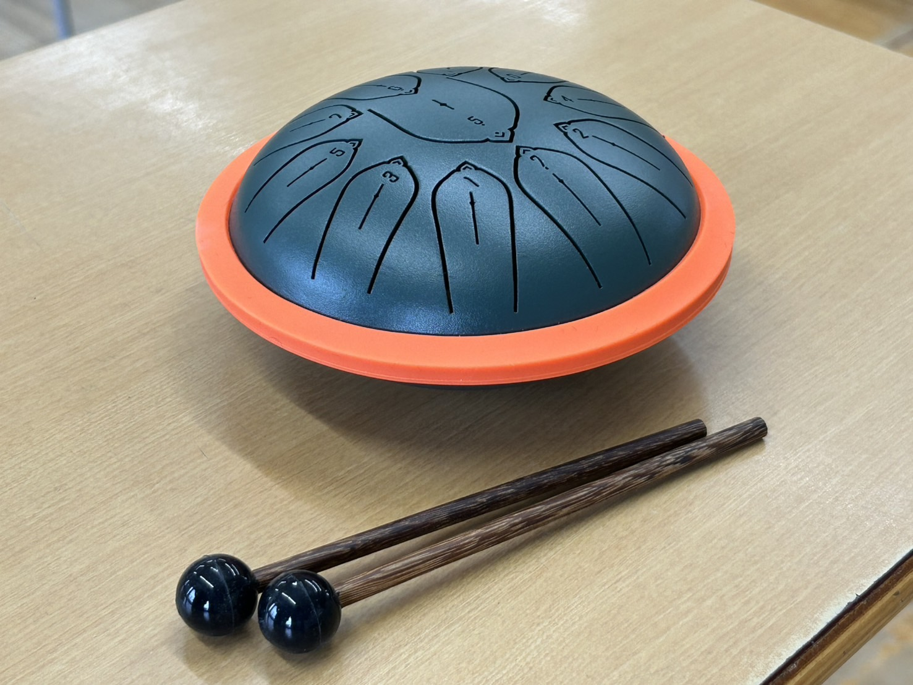
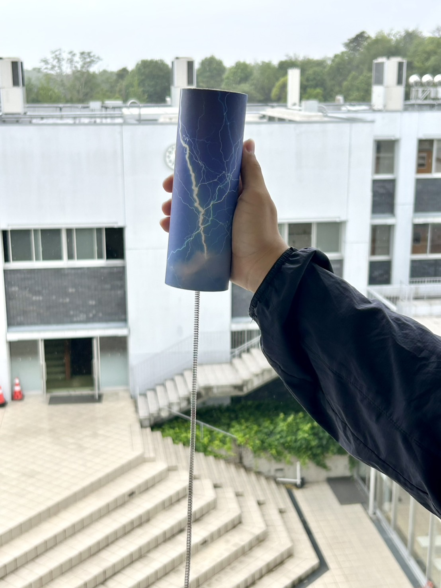
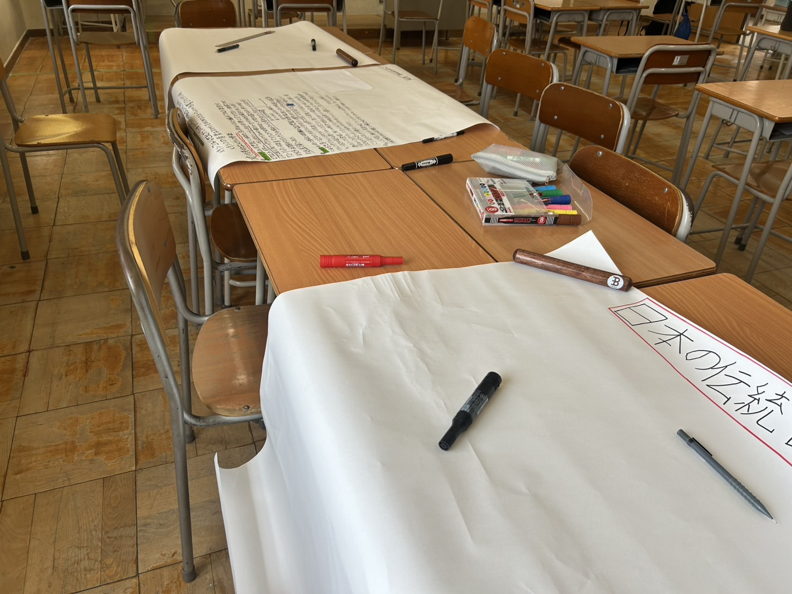
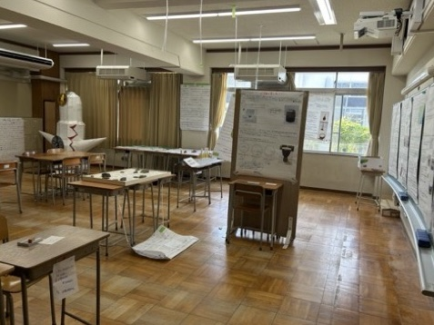
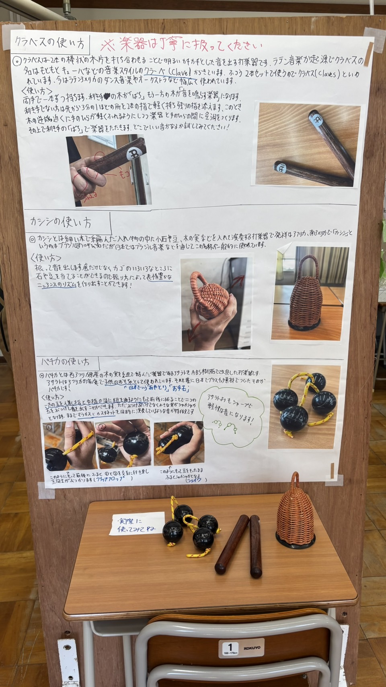

# 昨年度から新しくなった民族音楽同好会の魅力に迫る

昨年度から新体制となり、菁々祭での楽器展示を始めた民族音楽同好会。このブログでは、民族音楽同好会の活動や昨年の菁々祭での展示の裏側について紹介してもらいました！

# 普段の活動内容について

## 新体制になったと書いてありますが、どう変わったのですか？

一昨年までの活動から方針を大きく変え、名前の通り、民族音楽の研究をしたり楽器を集めたりしています。方針を変更するにあたって部員募集を大々的に行い、部員数は15人程度になりました！

## 普段は具体的にどんな活動をしていますか？

具体的には、互いに音楽の基本を教え合ったり、楽器を弾いたりしています。そして今年は民族楽器の専門店に行って楽器を買いました！　　　 とはいったものの、普段の活動はとても緩く、しゃべったり楽器を触ったりとのんびりしています。

新しく買った楽器その1

新しく買った楽器その2

ここでほかの3人の部員からコメントをいただいたのでご紹介します。

高1 部員Iくん
中2の終わり頃に民族音楽同好会というものがあるのを知りました。もともと世界の文化や音楽に興味があった僕は当時の高2の先輩に声をかけました。するとこの同好会が消滅危機にあることを知り、同級生に声をかけて仲間を集めて存続させることに成功しました。活動についても最初は手探りでしたが部員みんなで試行錯誤して今のような形態になりました。普段は民族楽器を学びながら日頃の勉強の疲れを癒せるようなゆるい雰囲気で活動しています。一方で文化祭前になるとみんな一気にやる気になり活発に活動するのも魅力だなと思います。

高1 部員Sくん
最近できた同好会で、まだまだ部員も楽器も少ないですが、これから頑張っていきたいと思います！ このクラブではクラブの内外を問わずアドバイスなどをいただきながら活動することがあります。もし何かアドバイス等あれば部員に仰っていただくと励みになります。 この展示を通じて民族音楽に興味を持ってくれる人が増えたら幸いです。

中1 部員Tくん
初めて入部したのがこのクラブでした。 音楽について詳しいという訳ではなかったのですが友達といっしょに体験入部期間中に尋ねてみたのが入部のきっかけです。 先輩方も歓迎してくださり、熱心に活動についての説明をしてくださりました。 民族音楽同好会に入部して本当によかったです。

# 去年の文化祭について

## 文化祭の準備の裏側などはありますか？

普段は緩くても、菁々祭前ともなるとしっかり活動します。夏休みに集まって、それぞれの地域の音楽や所有している楽器の説明などの模造紙を書きました。

夏休みに集まって模造紙を書いたりしました。

## 去年の文化祭展示について教えてください

去年は各地域の音楽についての模造紙を中心に、楽器の展示をしたり民族音楽を流したりしていました。

文化祭当日の展示　画質悪くてすみません　　　　　　（左半分は別の部活の展示）

楽器と模造紙展示

# 最後に

## では今年の文化祭の意気込みを教えてください！

今年は新しい楽器の展示や、去年とは違う様々な地域の音楽を詳しく調べる予定です。ぜひ一度、展示に足を運んでみてください！

[民族音楽同好会公式X](https://x.com/TDJminon2)