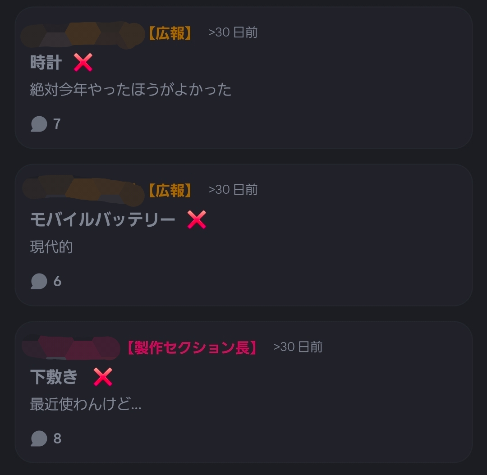
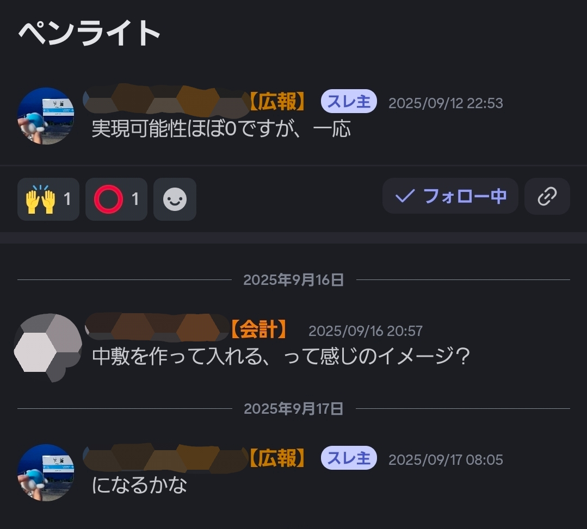
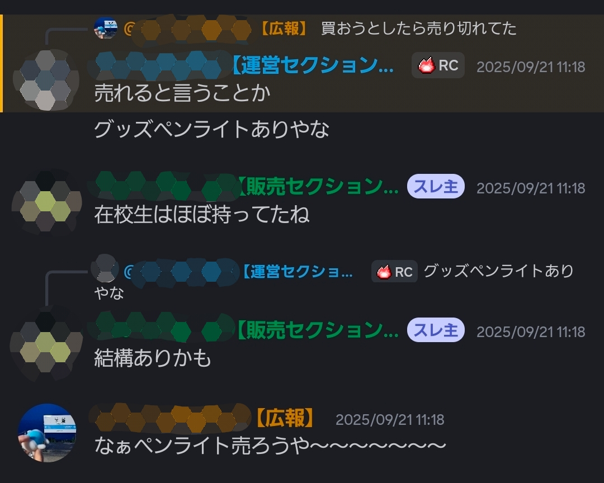
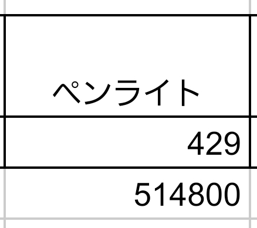
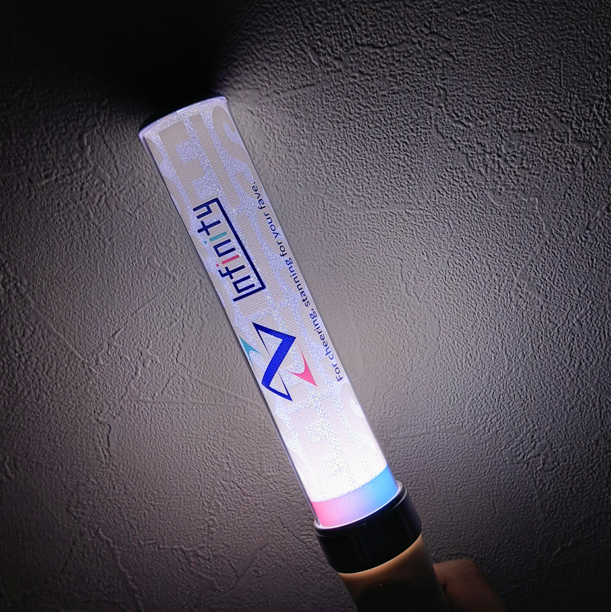

# 目次

今年の文化祭グッズの目玉的存在に、**ペンライト**がある。みなさんはペンライトにどのようなイメージを抱くだろうか。どんなイメージを持つにしろ、**「高校の文化祭のグッズとしてペンライトを販売する」**ということは、全国的に見てもかなり珍しいケースだろう。この記事では、ペンライトの文化祭グッズ販売の実現、その経緯、また進歩について、発案者である私の視点から見ていこうと思う。

# 2025年9月12日：始まり

全ての始まりは終わりのあとにある。ということで、去年の文化祭が終わった直後、グッズの品目選定のための話し合いがあった。

実現可能性が高いか低いかは関係なく、とりあえず売りたいものを各々提案してみるという形式で、最終的には**30以上**の候補が提案された。

いずれも没案である

その中で2025年9月12日に提案されたのがペンライトである。提案者は私である。

この時点で「実現可能性ほぼ0」と発言している

初めの想定は、100円均一ショップに売っている300円ほどのペンライトを買い、中敷を手作業で交換し、文化祭仕様にするというものだった。しかしこれは、中敷の交換が大変、またショップ側の在庫が少ないということでボツになった。

ここで壁に激突してしまう。100均ルートが使えないのであれば、製品を業者さんから仕入れるという形になる。こうなると100均よりは確実に高くなってしまう。文化祭グッズに割ける予算には限りがあり、限られた金額しか使えない。

## 要するに、「詰んでしまった」のではないかと。

家電量販店などで販売されている高品質のペンライトの販売額は3000円ほどである。またアクリルキーホルダーなどと違い、売れるという確証がない商品である。こういう商品に割ける予算というのはだいぶ限られてくる。売れるのか……？

# 2025年9月21日：転機

転機が訪れた。去年の菁々祭から2週間後の日曜、とある学校の文化祭に訪れる機会があった。そこで私が見つけた衝撃的なものとはなにか。

## そう、ペンライトの販売である。

しかも、私がグッズを買おうとした頃にはもう売り切れていた。バンドの演奏に行くと、「ペンライト持ってる人白付けてください！」などといった、ペンライトの存在を認知し、応援を煽るようなセリフを聞いた。これは、**「文化祭グッズとしてのペンライト」が明らかに成功している**例であったのだ。

緑文字の同級生はたまたま同じ学校の文化祭に行っていた

これを見た瞬間、私は「いける！」と思った。

もう1つの転機があった。1個1200円ほどで仕入れることのできるペンライトの業者さんを見つけたことだ。2年前の菁々祭では1500円の扇子が売られていたりもしたので、消費者の目線から見てもそこまで高く感じられない値段設定にすることができる上、仕入れ値の観点から見てもおそらく予算の範囲内に収まるだろう、ということで、**ペンライト販売実現が一歩前進した。**

違和感を感じる言い回しだ

こうして、ペンライトの販売は決定したのだった。

# 2026年5月26日：個数決め

日付は飛んで、年すら通り越し、この日にグッズの個数を決めることに。

販売するグッズはほとんど決まっていたので、あとは予算との兼ね合いで個数を考えるという形になった。ここでは在校生向けの事前販売と、当日販売で合計200本を売ろうと決まった。のだが、（いい意味で）大きく予想を裏切られることに……

# 2026年6月19日・20日：事前販売受付

販売当日。自ら受付をしていて思う。

### （中学生、ペンライト買いすぎでは……？）

高校生の売れ行きも相当良かったが、それはさておき、全くペンライトを買わないと予測していた中学生が、1本、2本、はたまた4本(！)と買っていくではないか！これには販売スタッフ一同驚愕してしまった。

結局、6月19日の受付が終わった時点で、事前当日合計の200本を超えてしまい、事前販売が全て終了した頃には**なんと429本も売り上げてしまった。**嬉しい悲鳴がそこら中から湧いて出てきていたのをはっきりと覚えている。

上から順に品目、販売個数、売上

この売れ行きのおかげで、当日ではより多くの個数を売ることができるようになった。ということで、**当日はぜひペンライトをお買い求めください！**15色に光る・イベントの熱狂的な応援に参加できる・デモ電池が付属しているためすぐに使用できる、などなど、メリットはたくさんあるので、ぜひ。デメリットは売り切れてしまうかもしれないことぐらい。

# 2026年7月11日・13日：事前販売引き渡し

そうしてついに、ペンライトが私のもとに、購入した生徒らのもとに届いた。

白色に光るペンライト

ちゃんと光る。当たり前と言えば当たり前なのだが、発案してからの10ヶ月間を思うと、尚更輝いて見えるというものだ。この光が、文化祭当日の熱狂する体育館を眩しいぐらいに照らしてくれれば、と思う。もっとも、そう願って発案したのだ。

# おわりに

ここまで読んでくれてありがとうございます！

今回は実録ドキュメンタリーみたいな感じで書いてみました。また、ペンライトの実現にあたっては多くの方々の尽力がありました。直接的なところで言えば、デザイン担当者には最大級の感謝を申し上げたいです。インテリアとして家のどこかに置いておきたいぐらいには良いデザインで、すごく感動しました。本当にありがとうございます。

改めまして、**第62回菁々祭“Infinity”ではペンライトを販売します！**お買い求めいただければ幸いです。売り切れる前にお早めに。