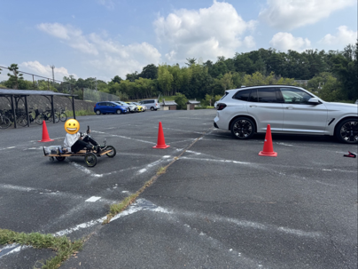

# 自動車硏究會に就いて

車好きで集まり、研究したい。その志を持つ人が集まり、一昨年に有志団体として誕生した自動車研究会。同好会昇格から今年で2年目となる、その実態に迫ります。

# 結成

一昨年に行われた第60回菁々祭が終わり、次の菁々祭に向け準備が始まろうとしていた九月下旬、現在の会長であるS君が「車好きで集まり、車について研究したい」と考え、同好会の結成を決意しました。
当時の生徒会規定「有志団体に対する規定」では、6か月以上有志団体として活動した団体にのみ、同好会に昇格できることとなっていたので、まずは有志団体を結成する必要がありました。そこで、当時中学一年だったS君は、仲間を集め、11月に有志団体の結成が承認され、活動を開始しました。
有志団体の結成を判断する有志団体等管理委員会の当時の委員長に、「何か目指すものを決めて活動しないと、長続きしない」と助言を受け、以前より興味のあった自作バッテリーカーの大会（後述）に出場することに決めました。
そして、昨年の4月には顧問の先生を見つけ同好会に昇格し、無事、本格的な活動を始めることができました。

# 一年の活動

自動車研究会の活動は、大きく分けて三つの時期に分けられます。

# ４月から８月下旬

8月下旬に開催されるエコ１チャレンジカップ（後述）に出場するため、バッテリーカーを作ります。自動車研究会にとって一年で最も忙しい時期です。

## エコ１チャレンジカップへの挑戦

### ～中高生による手作り自動車コンテスト～

昨年は、自動車技術会関東支部、東京都市大学、日産自動車が共催するエコ１チャレンジカップ２０２５に出場しました。

### 車両（TEV-1）作り

何の知識もなかったので、ネットで調べたり、人に聞いてみたり、色々チャレンジしました。
車体を作ろうと思った時に、まず車輪の配置を考えました。四輪だと、後ろが2輪のため曲がりにくく重いので、前1輪、後ろ2輪にしようと思いましたが同様に曲がりにくく、規定で3輪以上と決められていたため、前2輪、後ろ1輪にすることにしました。
次に、材料。最初は、塩ビパイプで作ろうとしていましたが、高専教授の方に聞いたところ、強度が足りないと分かったので、鉄パイプかイレクターパイプを使おうと考えました。しかし、鉄パイプは重く、イレクターパイプは加工しにくいなど難点があり、鋼製のL字アングル、そして床に合板を使うことにしました。

モーターは、車体を小さく作ったこともあり、インホイールモーターにしました。

そして、一番難しかったのが足回り。タイヤと本体をつなぐ部分は考えた結果、台車のキャスターを使用して作ることができました。ステアリングも苦労の連続で、ハンドルとの連結部分は縦穴で回転範囲を確保し、タイヤの回転角度３０°を確保するため頑張りました。

ハンドル部分も苦労しました。鉄を削り、大きく曲がるように改良し、工具の一部品の直径が奇跡的にぴったりだったことを利用した結果、強度が上がり、遊びも劇的に少なりました。

電子系でもかなり苦労しましたが、日産の方と相談して、改良することができました。

### 出場

会場が東京の多摩自動車学校だったので、全員前日に現地入り。車両は会員の保護者の方が車で運んでくださいました。
本番前に試運転を行っている際に、ハンドルの接続部分が取れ、コーンに激突してしまいました。急いでハンドルを接続し直しましたが、充分修理する時間はないまま、本番が始まりました。

コースは500メートル×10周で制限時間は30分。バッテリーの問題で8A以上出してしまうと完走できるか心配だったので、かなりスピードを抑えて走りました。しかし、６周目で試運転の時と同じようにハンドルが取れてしまい、運転手以外がコースに入り、修理したため、１分のペナルティが加算されました。その事故は８周目でも起きましたが、ピット内だったのでペナルティはありませんでした。

その結果、３分ほど失いましたが、**11位、27分22秒**で完走することができました。
運営の方にも初参加で完走できたことを褒めていただき、**自動車技術会賞**を受賞することができました。

# 大会終了から菁々祭

菁々祭に向け、急いで展示の準備をします。

## 菁々祭での展示

昨年は、TEV-1、生産が終了した日産GT-Rの特集とミニカーを展示し、ラジコンレースを行いました。

ラジコンレースは、来場した皆さんに楽しんでいただけましたが、~~エコ１と同じように~~コースの壁に激突することが多かったので、今年はそのようなことが少なくなるようなコースにする予定です。

# 菁々祭から４月

閑散期。あまりすることが見つからない時期。

# おわりに

ここまで読んで頂きありがとうございました。
まだ執筆段階ではわかりませんが、今年の菁々祭では、エコ１チャレンジカップ２０２６に出場したバッテリーカーや菁々祭のテーマにあわせた日産インフィニティの特集を展示し、ラジコンレースを開催する予定です。
ぜひお越しください！