# 毎年大人気！鉄道研究部のウラ側・展示の見どころを解説

文化祭の展示で毎年多くの人を集める鉄道研究部、通称「鉄研」。本記事では、そのウラ側に迫ります。さらに、部員目線の「展示のここを見てほしい」というポイントなど、ここだけのウラ話も掲載！

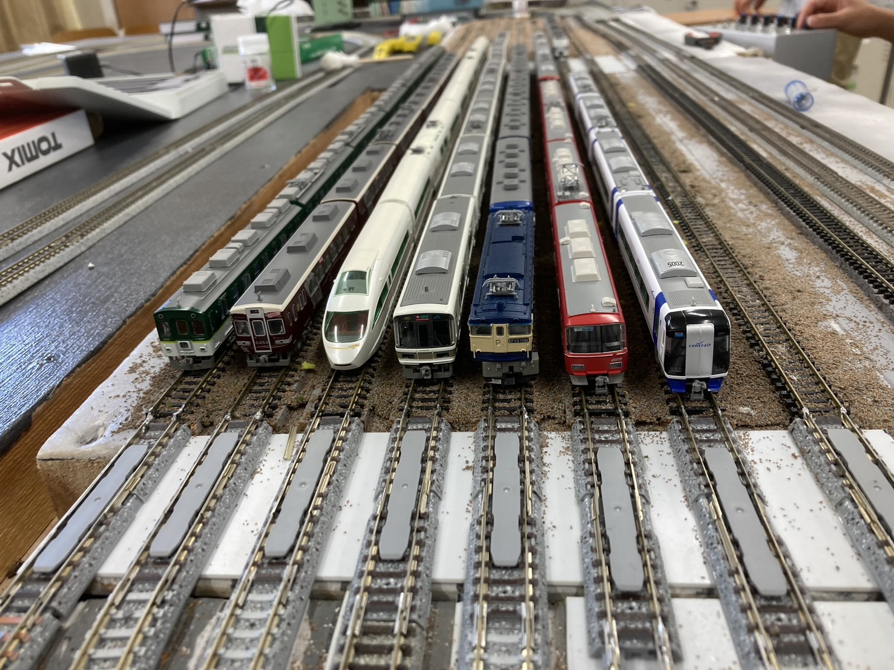

これまでの菁々祭を走り抜けてきた車両の一部。

# 普段どんな活動をしているのか？

大きな活動としては、年に2〜3回日帰りで遠足をしたり、毎年春休みに新中3生以上の有志で旅行を行います。一方、何もやることがない時期は、数人ごとに集まって雑談をしたり、中学生は自ら撮影してきた日本各地の鉄道の映像を見せ合ったりと、自由奔放に過ごしています。（活動…？）

筆者の学年である高2生は、たまたま野球ファンが多く、野球の試合や球団に関する雑談で盛り上がることもしばしば。

#### しかし、だらけているばかりでもいられません。

昨年（2025年）は当部活にとって躍進の年となり、東京・新宿で開催された全国高等学校鉄道模型コンテストに出展しました！このためにジオラマを製作していました。ちなみに、これをきっかけに関東の学校の鉄道研究部員と仲良くなった部員もいるそうです(羨ましい限り)。

今年も2026年8月7日～9日の3日間、出展します！

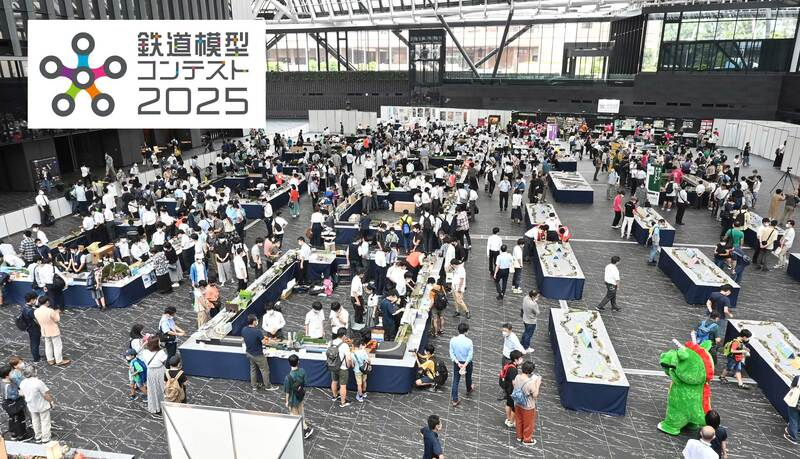

コンテスト全国大会の様子。計**188校**が参加していたようです。さすが東京開催、規模が違う。（写真は岩手日報ONLINEよりお借りしました）（右下の緑色の着ぐるみは埼玉・鶴ヶ島市のマスコットだそう）

なお、出展作品は菁々祭当日にご覧になれます。

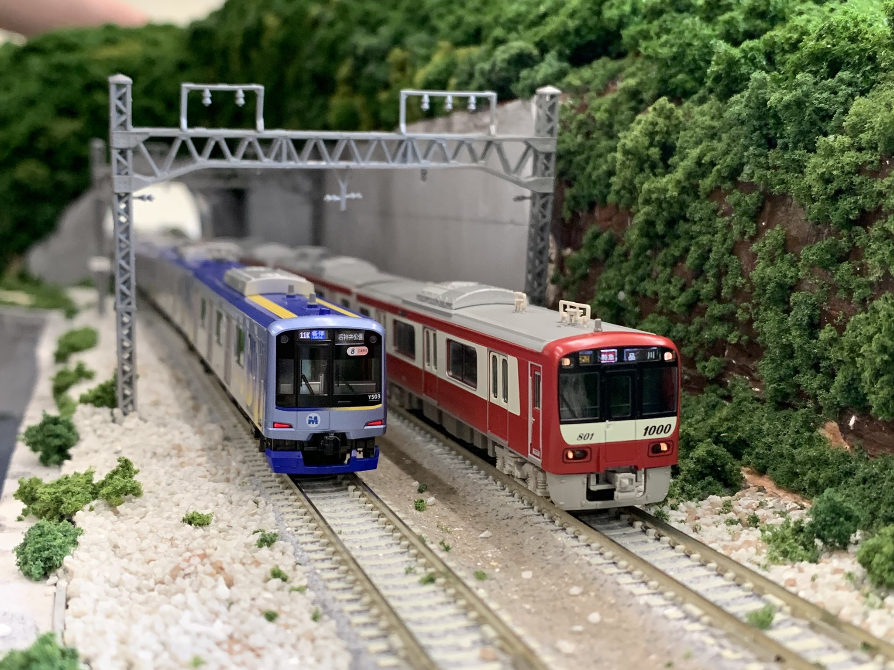

昨年度（2025年）の出展作品をチラ見せ！

このコンテストに出展する以前は、夏休み前くらいから文化祭準備を始めるくらいのスケジュールでしたが、今は新年度から真面目に活動し始め、夏休み中には週5日ほどのペースで活動するようになります…。

### **忙しいっ！！！😇（心の声）**

# なぜこれほど多くの人が集まるのか？

やはり展示内容（詳しくは後述）が一番の理由でしょう。

しかし他団体と比べても顕著に言えるのは、子連れでいらして下さる方がとても多いです。

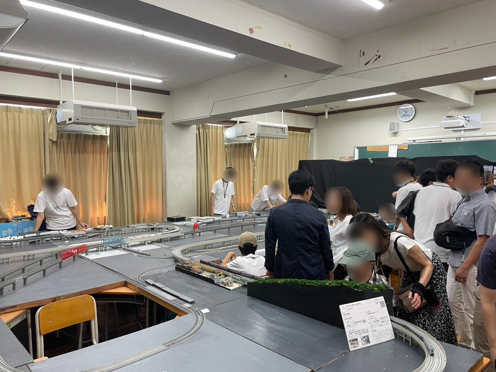

第61回（2025年）の様子。

そもそも子どもは鉄道に興味を持つ傾向が強いのではないでしょうか。動くものが好きだったり、ガンダムのような大きな機械に惹かれたり。小さい頃から鉄道好きであった筆者自身も思うのは、鉄道博物館や鉄道に関する展示施設に行くと、男の子が多く訪れている印象を受けます（あくまで筆者の主観にはなりますが…）。

# 本年はどんな展示をするのか？

展示内容は、※**Nゲージ**をはじめ、**プラレール**、**部員の撮影した写真**、**中1生による壁新聞**などです。

※Nゲージとは、本物の鉄道車両の約150〜160分の1の大きさで作られた鉄道模型のことです。線路から給電して走りますが、もし小さなお子さんが線路に触ってしまっても感電することはありません。

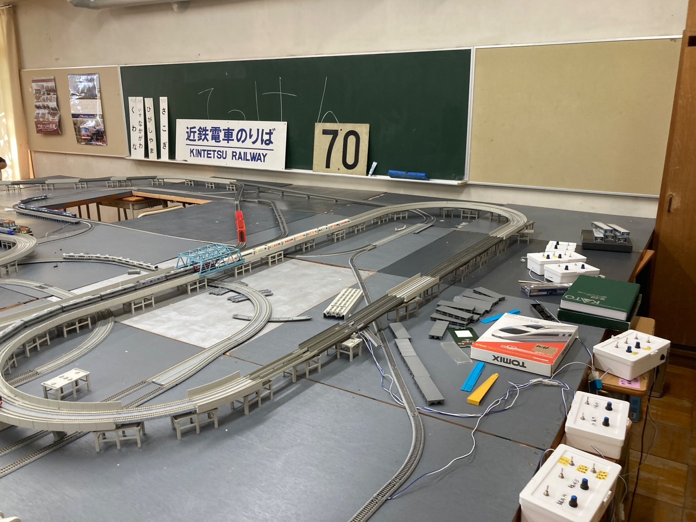

第61回（2025年）の直前期の試運転の様子。ジョイント音（いわゆる「ガタンゴトン」）が心地良く、何時間でも見ていられます。

ちなみに、実際の車両と同じく、Nゲージも車両同士を連結器（カプラー）で繋いでいるのですが、実際には全然違う地方で走っている車両や絶対に連結しないであろう車両も、**同種のカプラーであれば連結できます**（技術のある部員は組み換えることもあるそう）。例えば、写真中だと**JR西日本**（新快速）と**東京メトロ**、**京急**の車両を連結しています（菁々祭での運転の予定はありません）。

Nゲージコーナーでは、昨年と今年の鉄道模型コンテスト展示作品もご覧いただけます。さらに、**Nゲージの体験運転もできちゃいます**！

※体験運転は**整理券制**です。当日に展示室内受付までお越しください。

※前述の通り線路に手を入れても感電はしませんが、走行中の車両に引っかかり手を挟む、手の汚れが付着して電気の通りが悪くなる、後々線路が錆びる、部員の私物の車両が壊れるなどしますので、十分ご注意いただくようお願いいたします。

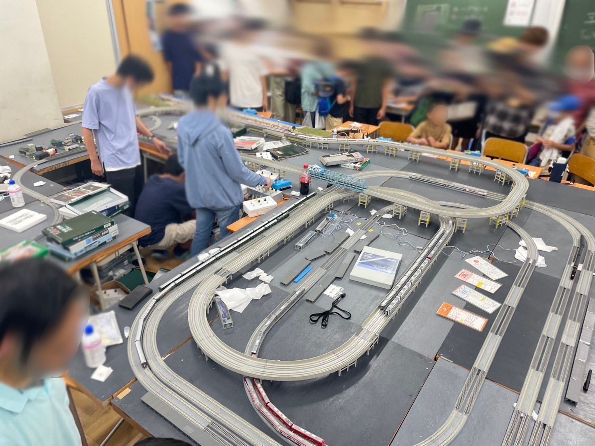

第60回（2024年）の様子。ここだけのウラ話ですが、写真の中央に写っている、コーラのすぐ横で何やら機械をいじっている青い髪の人が当時の**部長**で、なんとこの年は**テレビ取材**まで来ていました。そこで志望校を宣言させられ関西中で放送されましたが、宣言通り無事に京大生（現役合格）となりました。今年も当部の展示を見に来てくれるようで、嬉しい限りです。あと、コーラは愛飲していましたが、最近節制しているそう。なお、その元部長の左が現会計(当時中3)、そのまた左が筆者(同上)です。懐かしい。

ある決まった時間帯に、展示室の電気を消灯して運営することがあります。この時、Nゲージ側で、模型の中に車内灯を取り付けた列車だけを走らせています。さながら夜に走る列車のようで、すごく印象的でした。運が良ければ現地でご覧になれるかも。

プラレールコーナーでは、Nゲージと同様、毎年お子さんが釘付けになっている様子が見られます。筆者の幼少期が懐かしくなり、微笑ましいです。

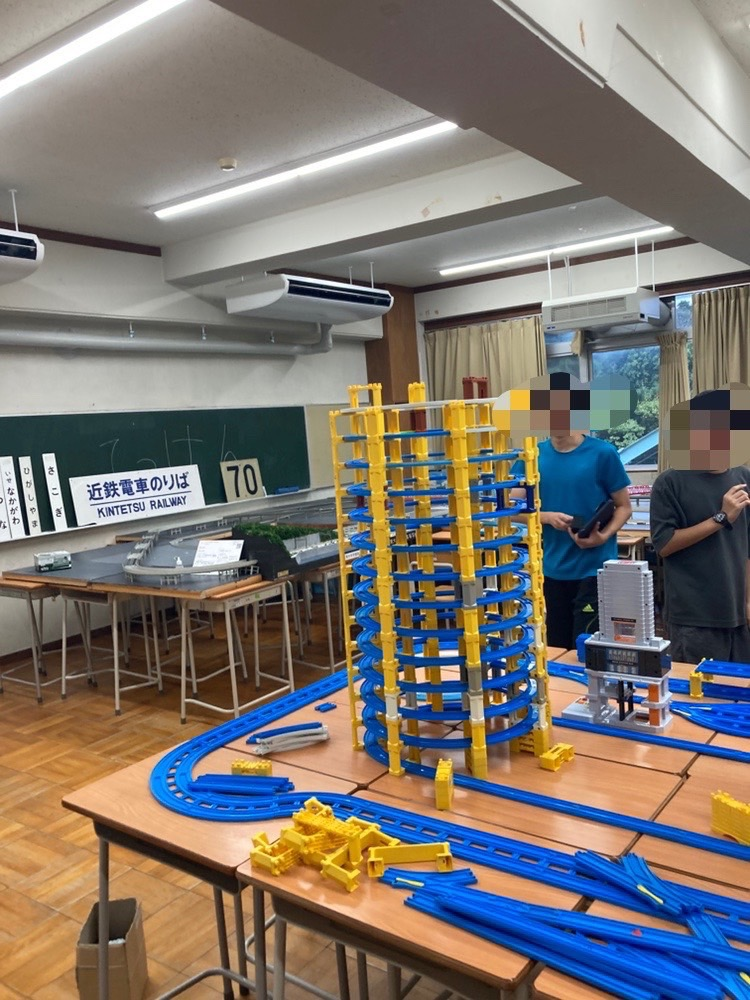

第61回（2025年）直前、プラレールのレイアウトを検討しているところ。

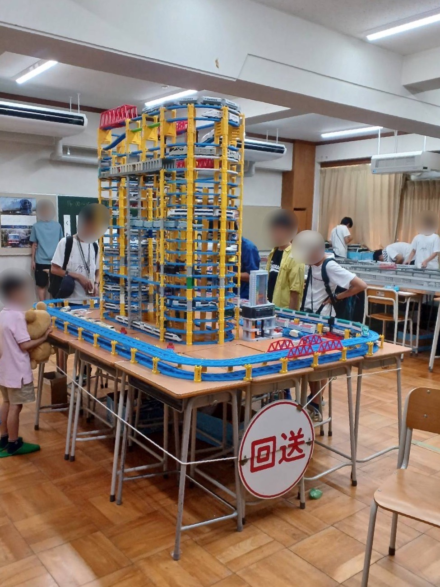

第61回（2025年）の様子。何と驚異の**21階建て**（！？）個人では容易に成し得ない規模感に圧倒されていました。

部員の撮影した写真コーナーでは、当部活の精鋭たちが、カメラを携えて日本各地で撮影してきた鉄道写真を掲示しています（一部は部誌の表紙に掲載）。時たま海外の車両も混ざっており、日本では見られないような顔つきをした車両がちらほら。

ここ2年ほど、部誌の裏表紙には海外の鉄道車両が採用されていますが、今年は未定です。

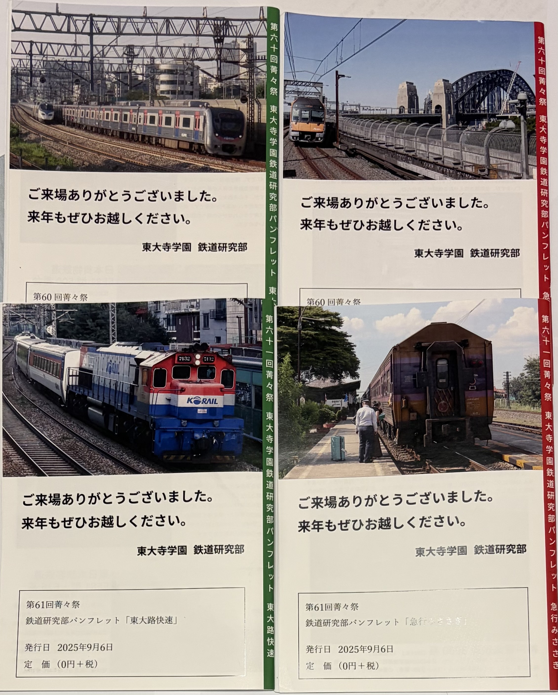

第60回（2024）・第61回（2025）部誌の裏表紙一覧。いずれも海外の鉄道車両となります。

中1生による壁新聞は、関西圏の鉄道に関する内容となる傾向があり、あまり鉄道知識のない方も比較的馴染みやすい内容になると思います（多分）。

# ここで宣伝！①部誌について

筆者も一昨年より寄稿しています。旅行記、時事ネタ、特定の鉄道車両や路線、鉄道会社をクローズアップした解説から、「普通電車に1日乗り続けてどこまで行けるか」とか「近鉄電車の放送システムを製作してみよう」など、ちょっとユニークなテーマまで扱っています。部員の知識と趣向と個性が結集した作品ですので、読み応え抜群！！ 

#### **ちなみに、部員数の増加により、昨年は2冊→3冊／年に増刊しています。**

編集部によると、今年も**「多い方が楽しいので多分出す」**とのこと。**（出なかったらごめんなさい）**

（紙の部誌の数には限りがありますので、在庫がなくなってしまったらご容赦ください。その場合はデジタル版でお読みいただけます。）

# 夏休みの鉄研の目玉（？）行事！製本作業のウラ話

毎年、部誌の製本をお盆明けに行っています。ここで特筆したいのは、**製本の品質**！

というのは、**ホッチキスの検品**が本当にハイレベルなんです！ホッチキスの位置や角のズレなどを厳しくチェックしています。来場者の方に最高品質の部誌をお渡しするため、筆者も含め、この検品に毎年苦戦しています（笑）。こだわって作っていますので、紙の部誌を入手できましたら、その点にもぜひ注目してみてください！

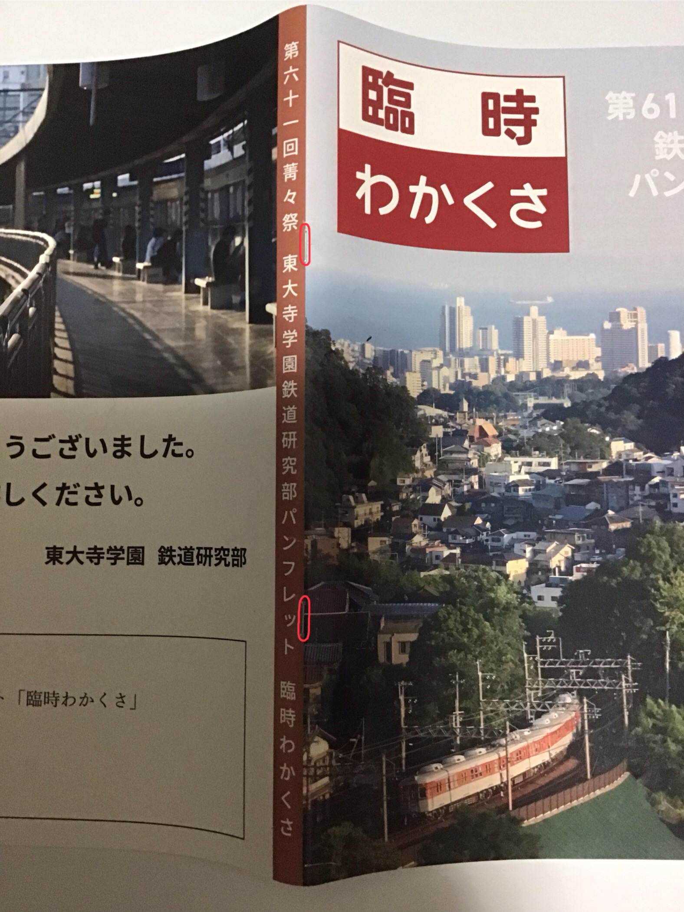

昨年度の3冊目。分かりにくいですが、完璧なホッチキス。また割愛しましたが、この裏表紙も海外の鉄道車両。

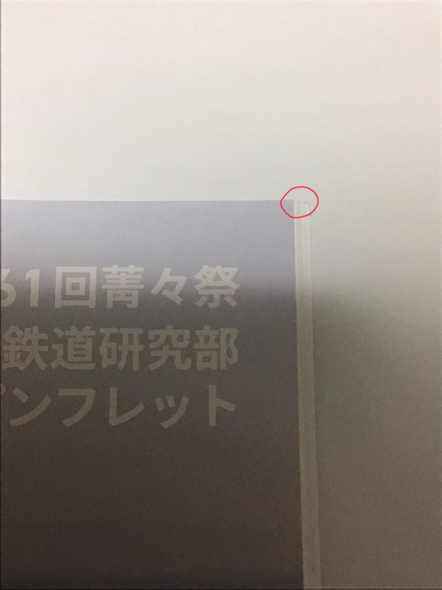

角も綺麗に揃っています。模範的な部誌です。

# ここで宣伝！②部のスタンプについて

本校の文化祭では、来場者の皆様にパンフレットをお配りする予定ですが、**その中に「スタンプ帳」が付属しています。各展示団体のスタンプを集めると、何か良いことがあるかも！？**

※スタンプ集めのために校内を走り回らないようにお願いいたします。

※鉄道研究部では、展示室内を**一方通行**といたします。毎年スタンプ集めなどのために順路を逆走する方がいますが、危険ですのでご遠慮ください。

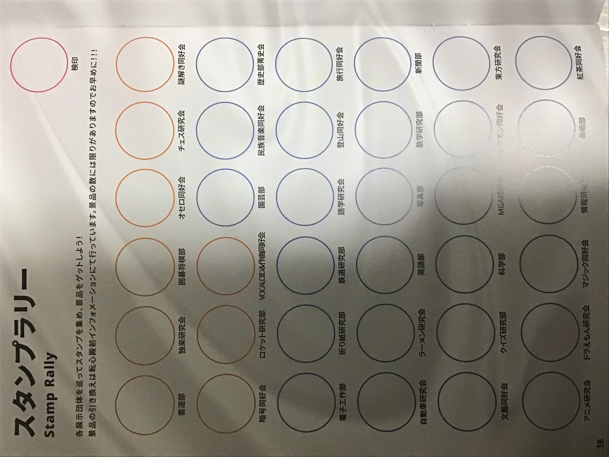

第61回(2025年)のスタンプ帳。(菁々祭パンフレットより)

最後までお読みいただき、ありがとうございました！筆者の述懐や展示での注意事項が多めになってしまいましたが、当部に少しでも興味を持っていただけたら嬉しいです。

[当鉄道研究部公式X](https://x.com/tdj_tekken)では、鉄研に関する広報などを随時行っていますので、ぜひチェックしてみてください。

#### 9月12日・13日、1年E組教室で部員一同お待ちしております。ぜひお気軽にお立ち寄りください！