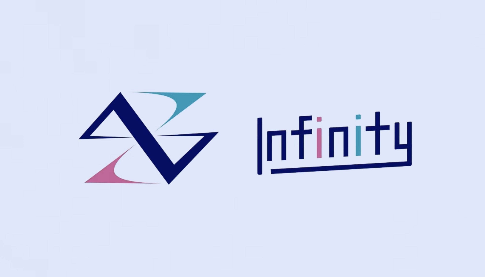
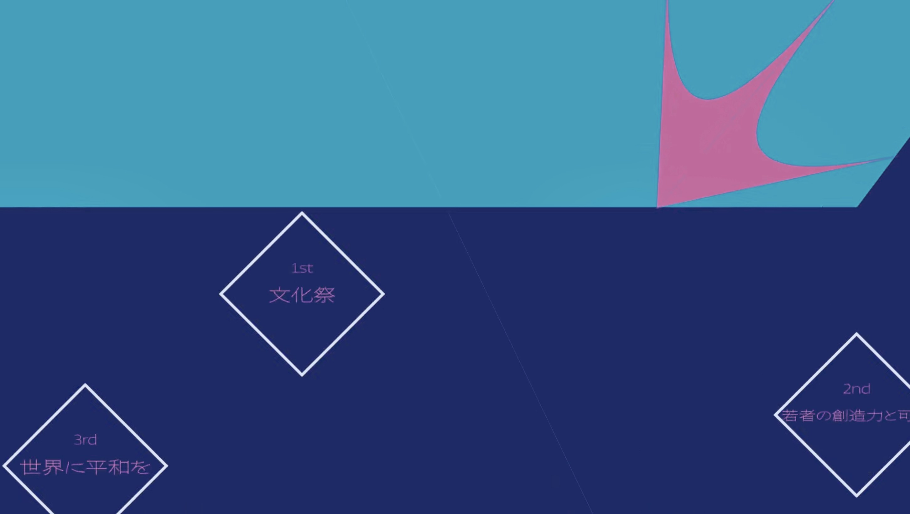

# 菁々祭テーマ・ロゴ発表PVについて

みなさんは、今年の菁々祭のPVはご覧になりましたか？毎年PRパートでは、文化祭やそのロゴに関してのPVを製作し、Youtubeに投稿しています。未視聴の方は是非ご覧ください！

[https://youtu.be/gEj_JFokp90?si=yEYEipB0uU3SNnWG](https://youtu.be/gEj_JFokp90?si=yEYEipB0uU3SNnWG)

どうでしたか？僕はこのPVがすごくよく出来ているなと思ったので作成者に聞いてみました。

# 製作者へのインタビュー①

　まず、画面に「Theme and Logo」と映し出されてから三秒数えたあとにロゴが発表され、その説明が出てきますよね。ここの部分でアニメーションのどこを拘ったか教えてもらいました。

このアニメーションです。11~18秒のところ

「Infinityというと「∞」がテーマなので、その形に沿ってロゴを描くアニメーションにしたいと思い、速さの強弱やタイミングを拘りました。」

やはりあの流れるようなアニメーションにはそのような拘りがあったんですね！

では、どのような思いで作ったのでしょうか？

　「このPVは、全校生徒にその年の菁々祭のテーマとロゴを初めて知ってもらうものです。 僕も過去のPVが忘れられず、今年もその感動を全校生徒に与えたいと思い作成しました。」

# 製作者へのインタビュー②

　では、このテーマとロゴを紹介したあと、「Now Loading」と表示される所がありますが、その前後を作成した方にもお話を伺うことができました。

　「初めにテーマを見たとき、正直「菁々祭っぽくないな」って思ったんです。二日間の為に、終わった次の日からその一年間を燃やし尽くす 「無限」とは程遠いけど熱い祭り。私達の成し逐げたものも、残り続ける訳ではないですが、「Infinity」と向き合ううちに、あるものを見つけました。二十年以上前からの引継書の束です。一年間、一分一秒を大切に菁々祭に向かうという熱い気持は、二十年来変わらず今まで受け継がれている、と感じました。それならば、「無限」と銘打たれているのだから今までの「菁々祭」を登場させないといけないなと思ったんです。だから実はPVの0:26~28の間でこっそりと、第一回から第二十回までのテーマを出していたんです。

ひし形の中に、テーマが書かれています（0:26）

そしてそのあと名前は消え、Infinityのロゴを回転させて「無限」の一部となる。その後は、直近のテーマが動きにしやすいことに気づいたので、「五重奏」から順番に動きを作りました。そして最後に第六十一回テーマ「分秒」モチーフの時計のような動きで裂け、スクリーンという「限り」を消して「無限」になる、という構成です。確認していただけると私が喜びます(笑)」

　では最後に余談として、このPVを作るにあたって使われたソフトをお聞きしました。

　「映像の作成は初めてだったので、安心感のある Adobeソフトの After Effectsを使いました。始めはロゴを横にスライドさせる、回転させるのも難しくて思い通りにいきませんでしたが、チュートリアルや解説動画などで少しずつ慣れていきました。」

# 終わりに

ここまで拘って作られた一分以下のPVも少ないはずです。 是非一回はご覧になって、文化祭を楽しんで下さい！